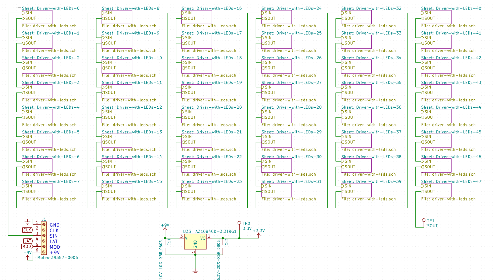
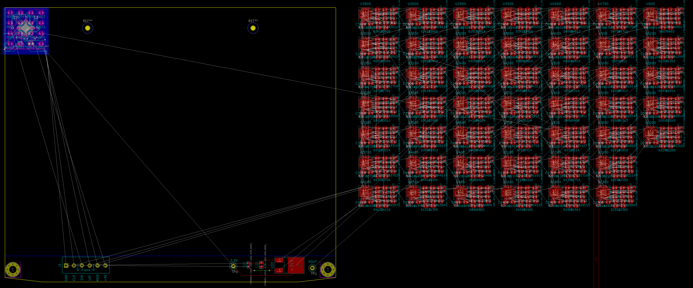
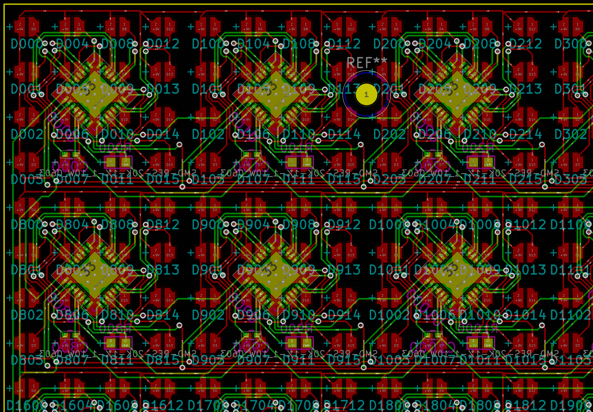

Clone part of a layout in Pcbnew.

## Usage

1. Organize the subschemas to be cloned in **hierarchical sheets**. Annotate them so that each sheet's components have reference ids starting with a different hundred. Export netlist.

2. Import netlist into Pcbnew. Draw edge cuts. Place and route the components that will *not* be cloned. Also lay out the lowest-numbered subschema as a template. Surround it with a filled zone in Cmts.User layer (<span style="color:blue">blue box</span>). Tracks must be *completely inside* the zone.

3. Save `EXAMPLE_NAME.kicad_pcb`. Edit your `layout_cloner.py` to match your circuit (instructions inside). Run it to produce `EXAMPLE_NAME_cloned.kicad_pcb` file. Open it in Pcbnew. The ratsnest may be wrong; toggle it off and on to fix.

4. Clean up the edges of the patterned components. Try to keep this step as short as possible, because this work will be lost if/when you revisit Step 2.



## Running script on Linux

Open Terminal and run:

```bash
python pcbnew_cloner.py
```


## Running script on Windows

Your system Python probably doesn't have dependency `pcbnew`. Easiest to use KiCad's bundled Python, PyAlaMode.

Edit `layout_cloner.py` again to make the paths absolute:
```
inputBoardFile = r'C:\REPLACE_WITH_PATH_TO_YOUR\EXAMPLE_NAME.kicad_pcb'
outputBoardFile = r'C:\REPLACE_WITH_PATH_TO_YOUR\EXAMPLE_NAME_cloned.kicad_pcb'
```

In Pcbnew, go to Tools > Scripting Console. Paste this command and press Enter.

```
execfile(r'C:\REPLACE_WITH_PATH_TO_YOUR\layout_cloner.py')
```

If you have non-ASCII characters in your path, use this command (note double backslashes). Paste and press Enter twice.

```python
with open(u'C:\\RÉPLACE_WÍTH_PÁTH_TO_YǪÚR\\layout_cloner.py') as f: exec(f.read())
```
